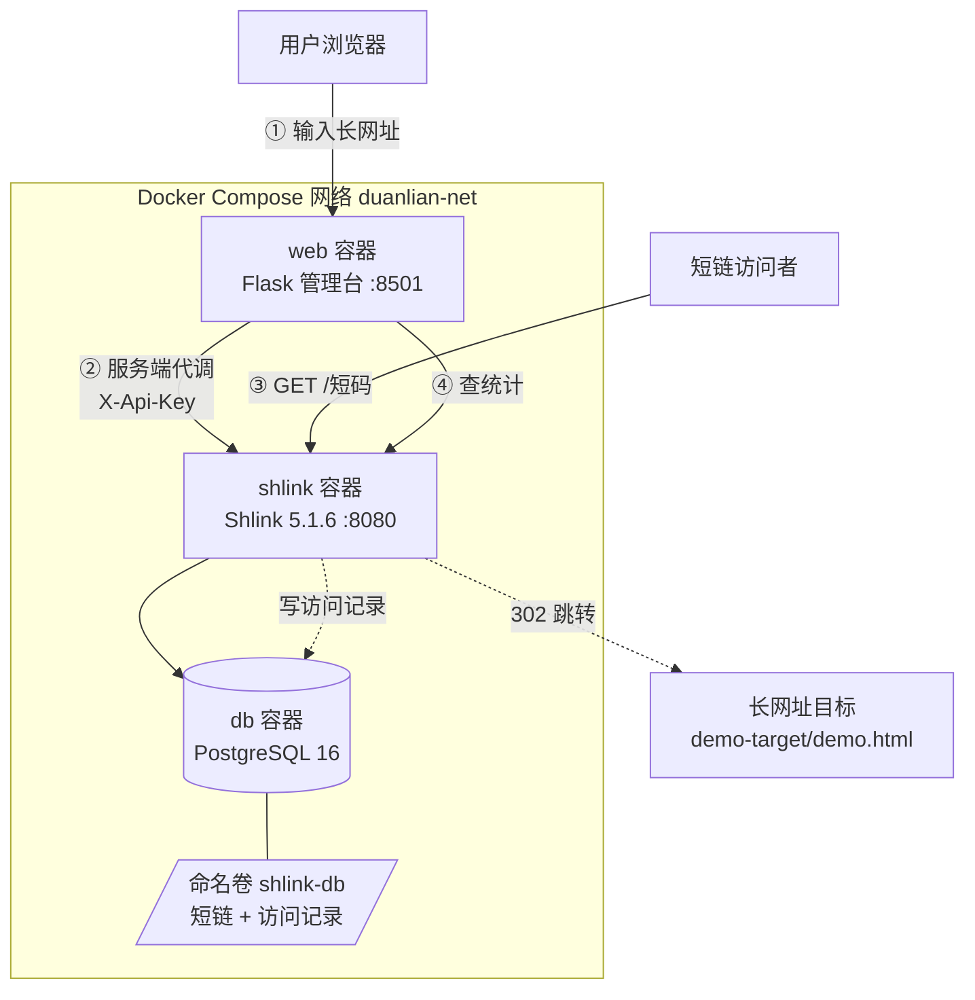

# shlink-shorturl-platform —— 容器化短网址服务系统

《开源软件与新技术》实验03 成品。以开源短链平台 **Shlink 5.1.6** 为基线，
用 Docker Compose 编排 **Shlink + PostgreSQL 16 + 自己写的 Web 管理界面**，
实现「生成短链 → 访问跳转 → 访问统计」的完整闭环，并做了三项自主扩展。

- 作者：王锐兵（软件2304，学号 23110506126）
- 管理台：<http://localhost:8501>
- 短链跳转：<http://localhost:8080/&lt;短码&gt;>
- 图形化看板：`docker compose up -d` 后直接开管理台，顶部有 Shlink 健康灯

> 本仓库是二次开发成品，**不是** Shlink / PostgreSQL / awesome-compose 的再分发。
> 上游版权归各自作者所有，来源与许可证见 [NOTICE.md](NOTICE.md)。
> 本人改动范围见下方「二次开发内容」。

---

## 一、目标用户与问题场景

**目标用户**：需要给课程作业、实验报告里的长链接做短链的学生/教师。

**问题场景**：报告里贴的实验室地址又长又容易写错；想统计「到底有没有人点开过」
也完全没数据。现成的公网短链服务有两个问题：一是要注册、二是把访问数据交给了第三方。

**功能清单**：

| 功能 | 说明 |
| --- | --- |
| 生成短链 | 输入长网址得到短链，支持自定义短码与有效期 |
| 访问跳转 | 访问短链 302 跳回原网址 |
| 访问统计 | 累计访问次数、按来源、按日期、最近访问记录 |
| 短链列表 | 分页列出、支持搜索、显示创建时间与到期时间 |
| 二维码 | 每一条短链可在线预览 / 下载二维码（自主功能①） |
| 有效期 | 可设 0~365 天，到期自动失效（自主功能②） |
| 创建限流 | 同一 IP 滑动窗口限流，防刷（自主功能③） |
| 健康灯 | 分别显示 Web 与 Shlink 的状态，排障时能分清是谁挂了 |

---

## 二、技术栈与系统架构

### 技术栈

| 层 | 用了什么 | 固定版本 |
| --- | --- | --- |
| 短链 API | Shlink 官方镜像 | `shlinkio/shlink:5.1.6` |
| 数据库 | PostgreSQL 官方镜像 | `postgres:16.14-alpine` |
| Web 界面 | Flask 3.0.3 + 原生 HTML/CSS/JS | 见 `web/requirements.txt` |
| Web 服务器 | gunicorn 22.0.0（单 worker） | — |
| 编排 | Docker Compose v2 语法 | — |
| 测试 | pytest 8.3.3 | 68 条 |

版本都写死了具体小版本，不用 `latest` / `stable`——那两个标签会移动，明天拉到的就不是今天验证过的东西。

### 架构



### 架构说明（报告里也会讲这几点）

1. **浏览器不持有管理密钥**。`X-Api-Key` 只存在于 `web` 容器的环境变量里，
   浏览器调的是我们自己的 `/api/*`，由服务端代发。
2. **短链跳转不经过 Web 服务**。访问者直接打 Shlink，少了中间一跳，
   统计也更准；Web 只管管理和查询。
3. **数据在卷里，容器是易耗品**。`docker compose down` 再 `up`，
   短链和访问记录都还在。镜像和容器都可以随便重建。
4. **服务之间用服务名通信**。容器里的 `localhost` 指的是它自己，
   所以 `SHLINK_JICHU_URL` 必须写 `http://shlink:8080`，不能写 `127.0.0.1`。

---

## 三、环境要求与版本检查

| 软件 | 最低版本 | 本机实测 |
| --- | --- | --- |
| Docker Engine / Desktop | 25+ | 见下方「未验证边界」 |
| Docker Compose | v2 | 见下方「未验证边界」 |
| Git | 2.40+ | 2.54.0.windows.1 |
| Python（只跑 Web 单测时需要） | 3.11+ | 3.13.14 |
| 浏览器 / curl | 稳定版 | Chrome + Invoke-WebRequest |

版本检查命令：

```powershell
docker version
docker compose version
git --version
python --version
```

端口占用检查（8080 给 Shlink，8501 给管理台）：

```powershell
Get-NetTCPConnection -LocalPort 8080,8501 -State Listen -ErrorAction SilentlyContinue
```

---

## 四、安装、配置、启动、停止

### 4.1 配置

```powershell
Copy-Item .env.example .env
```

然后编辑 `.env`，**必须改这两个**（生成随机值，别用示例里的）：

```powershell
# 生成 32 位随机口令，直接粘到 .env 的 POSTGRES_PASSWORD
-join ((48..57)+(65..90)+(97..122) | Get-Random -Count 32 | % {[char]$_})
```

- `POSTGRES_PASSWORD` —— 数据库口令
- `INITIAL_API_KEY` —— Shlink 管理密钥，**首次初始化时写进数据库，之后改这个值不会生效**，
  要么保持不动，要么清库重建

`.env` 已在 `.gitignore` 里，不会进 Git。提交物里只有 `.env.example` 的占位说明。

### 4.2 一键启动

```powershell
.\scripts\qidong.ps1
```

脚本会依次做：检查 docker → 检查 `.env` 是否还是占位符 → 检查端口 →
`docker compose config --quiet` 校验插值 → `up -d --build` → 轮询健康检查。

不想用脚本的话，手动三步：

```powershell
docker compose config --quiet        # 先校验，别等启动失败才查
docker compose up -d --build
docker compose ps                    # 三个都该是 running / healthy
```

### 4.3 停止

```powershell
.\scripts\tingzhi.ps1     # 等价于 docker compose down，保留数据卷
```

### 4.4 备份与恢复

```powershell
.\scripts\beifen.ps1                          # 导出到 beifen/duanlian-<时间>.sql
.\scripts\huifu.ps1 -Wenjian beifen\xxx.sql   # 恢复（要手打 yes 确认）
```

### 4.5 ★ 破坏性清理警告

```powershell
.\scripts\qingli.ps1     # 执行 docker compose down -v
```

**这会删掉命名卷 `duanlian-shlink-db`，短链和全部访问记录不可恢复。**
脚本里有两道确认：先问你有没有备份，再要你手打 `DELETE-VOLUME`。

> ⚠️ 正常验收**不要**执行这条。平时停服务只用 `tingzhi.ps1`。

---

## 五、演示流程

### 5.1 准备一个「完全离线」的长网址目标

实验要求离线也能演示，所以长网址不指向公网，而是本地一个静态页：

```powershell
python -m http.server 9001 --bind 127.0.0.1 --directory demo-target
```

先在浏览器里手动打开 <http://localhost:9001/demo.html> 确认能打开，再进下一步。

### 5.2 完整 Demo

| 步骤 | 操作 | 预期结果 |
| --- | --- | --- |
| 1 | 打开 <http://localhost:8501> | 顶栏两个健康灯都是绿的 |
| 2 | 填长网址 `http://localhost:9001/demo.html`，短码填 `demo01`，有效期填 `30` | 出现绿色结果框，显示短链和二维码 |
| 3 | 点「复制」，新标签页打开短链 | 302 跳到 `demo-target/demo.html` |
| 4 | 刷新 3 次（或用无痕窗口） | 每次都能跳转 |
| 5 | 回管理台点短码 → 「统计」 | 累计访问变成 3（等几秒，见下方统计口径） |
| 6 | 点「二维码」 | 弹出下载 PNG |
| 7 | 填一个 `http://www.baidu.com` 再点生成 | 红色错误框：域名不在白名单内 |
| 8 | 短码填 `有中文` | 红色错误框：只允许 3~32 位字母数字 - _ |
| 9 | 再建一条短码 `demo01` | 提示「短码 demo01 已经被占用了」 |
| 10 | `.\scripts\tingzhi.ps1` 然后 `.\scripts\qidong.ps1` | 回管理台，demo01 和它的访问次数都还在 |

### 5.3 最小演示数据

`demo-target/demo.html` 是仓库里唯一的演示数据（一个静态 HTML），不需要额外种子脚本。
商品/用户之类的业务数据本实验不涉及。

---

## 六、统计口径（重要，容易吵起来的地方）

- **只有真实 GET 才计数**。用 `curl -I` 发的是 HEAD 请求，Shlink 不算一次访问。
  所以测试统计时要用浏览器或 `curl` 不带 `-I`。
- **统计是异步落库的**。访问完立刻查经常还是旧数字，等 5~10 秒再刷新。
  这不是 bug，是 Shlink 把访问记录异步写库的设计。
- **短链访问不经过我们的 Web 服务**，所以 Web 的日志里当然看不到这次访问，
  要去看 Shlink 的日志。
- 界面上的「累计访问」读的是 `visitsSummary.total`；
  抽屉里的「按来源/按日期」是拿最近 50 条原始记录在前端汇总的，不是全量。

---

## 七、测试

### 7.1 自动化测试（不需要 Docker）

```powershell
cd shlink-shorturl-platform
python -m venv .venv
.\.venv\Scripts\python -m pip install -r web\requirements.txt
.\.venv\Scripts\python -m pytest tests -q
```

实测结果：**68 passed**（6.90s）。覆盖：校验层 25 条、限流 6 条、
Web 接口与安全边界 37 条。

Web 层测试跑在 `tests/conftest.py` 里的假 Shlink 客户端上，
把 Shlink 的响应形状照抄下来（包括自定义短码冲突返回 400 这种细节），
所以**没有 Docker 的电脑也能把测试跑通**——这也是实验要求「可重复测试」的意思。

### 7.2 需要 Docker 的测试

```powershell
.\scripts\ceshi-api.ps1      # API 功能测试 T01-T10，直打 Shlink
.\scripts\ceshi-bushu.ps1    # 容器测试 C1-C5 + 持久化测试 P1-P3
```

### 7.3 各项测试的对应关系

| 实验要求 | 最低数量 | 本仓库 |
| --- | --- | --- |
| API 功能测试 | 8 | `ceshi-api.ps1` 10 条（T01–T10） |
| Web 功能测试 | 6 | `tests/test_web.py` 中 15 条 |
| 容器测试 | 5 | `ceshi-bushu.ps1` C1–C5 |
| 持久化测试 | 3 | `ceshi-bushu.ps1` P1–P3 |
| 安全边界测试 | 4 | `test_url_yanzheng.py`（协议/超长/白名单）+ `test_web.py` 密钥外泄检查 |

完整的命令与结果记录在 [docs/ceshi-jilu.md](docs/ceshi-jilu.md)。

---

## 八、二次开发内容（与上游基线的差异）

上游 Shlink 只提供 REST API 和一个官方的简化 Web 客户端。**本次实现的是管理台、
校验规则、风控和部署编排**，具体差异如下：

| 序号 | 我做了什么 | 上游有没有 | 文件 |
| --- | --- | --- | --- |
| 1 | Flask 管理台（列表、统计、二维码、删除） | 没有，只有 Swagger 文档页 | `web/` |
| 2 | 长 URL 协议 + 域名白名单强制校验 | Shlink 支持很宽的协议，**不做**白名单 | `web/url_yanzheng.py` |
| 3 | 自定义短码冲突的友好提示（把 400 翻译成中文 + 409） | 只会返回英文 `detail` | `web/app.py` |
| 4 | 有效期天数 + 上限限制（≤365 天） | Shlink 有 `validUntil`，但没有「上限」概念 | `web/url_yanzheng.py` |
| 5 | 二维码生成与下载 | 没有 | `web/app.py` |
| 6 | 按 IP 的创建频率限制 | 没有 | `web/xianzhi.py` |
| 7 | 服务端代理隐藏 API Key | 官方 Web 客户端要用户自己填 Key | `web/shlink_kehuduan.py` |
| 8 | Dockerfile / Compose / 健康检查 / 一键脚本 | 官方给了镜像，编排要自己写 | `compose.yaml`、`scripts/` |

### 自主功能说明（实验要求「至少 1 项」，这里做了 3 项）

**① 二维码生成与下载**（对应 Issue #3）
- 解决的决策问题：报告里贴短链，读者要手打；二维码可以直接扫。
- 用的 API 字段：`GET /rest/v3/short-urls/{shortCode}` 取 `shortUrl`，
  二维码内容是**短链**而不是长链——这样扫出来的访问照样进统计。
- 失败处理：短码不存在返回 404；服务器缺 `qrcode` 库返回 500 并明确提示装包。

**② 短链有效期**（对应 Issue #3）
- 解决的决策问题：临时分享的东西不该永久有效。
- 用的 API 字段：`validUntil`（ISO8601，脚本里按 UTC 换算）。
- 本人新增的规则：上限 365 天。上游没有这个限制，是实验规则；
  传 400 天会被我们自己的校验挡在调用之前，不会打到 Shlink。
- 失败处理：非整数、负数、超上限分别给不同的中文提示。

**③ 创建频率限制**（对应 Issue #4）
- 解决的决策问题：短链服务被脚本刷会污染数据库，也可能被拿去做钓鱼跳板。
- 本人新增的规则：同一 IP 在 60 秒窗口内最多 20 次。
- 实测证据：`tests/test_web.py::test_pinlv_xianzhi_fanhui_429` 自动断言第 4 次返回 429；
  另外 `test_feifa_qingqiu_yie_ji_ru_xianzhi` 断言**非法请求也计数**，
  否则攻击者可以拿一堆无效请求白嫖配额。
- **已知局限**（必须写清楚）：计数在进程内存里，所以 gunicorn 固定 `--workers 1`；
  重启清零；按 IP 限会让 NAT 后的多个用户互相影响。生产环境该用 Redis 或网关限流。

---

## 九、安全注意事项

| 风险 | 处理方式 |
| --- | --- |
| API Key 泄漏到前端 | Key 只在 `web` 容器环境变量里；测试里有一条专门断言首页 HTML 和 JS 里搜不到 `X-Api-Key` |
| Key 进 Git | `.env` 在 `.gitignore`；仓库里只有 `.env.example` 占位符 |
| 短链被当跳板 | 只允许 `http`/`https`；域名必须命中白名单；`javascript:` `data:` `ftp:` 等一律拒绝 |
| 白名单被绕过 | 用 hostname 精确/子域比对，不用 `startswith`，挡掉 `evil-localhost.com` 这类；有对应反例测试 |
| XSS | 前端所有接口文本都经 `zhuanYi()` 转义或用 `textContent`，不拼 `innerHTML` |
| 管理 API 暴露到局域网 | `127.0.0.1:8080:8080` 只绑回环 |
| 数据库口令 | 只从 `.env` 注入，`docker compose config --quiet` 校验时不打印 |

> 本实验是课程隔离环境，长 URL 白名单只放开 `localhost` / `127.0.0.1` /
> `host.docker.internal` / `shlink`。**对外发布前必须改为真实可达目标，
> 并补上更严的协议、域名和 SSRF 防护。**

---

## 十、上游与第三方资源

| 项目 | 用途 | 版本 | 许可证 |
| --- | --- | --- | --- |
| [shlinkio/shlink](https://github.com/shlinkio/shlink) | 短链 API 与访问统计 | 5.1.6 | MIT |
| [postgres](https://hub.docker.com/_/postgres) | 数据库 | 16.14-alpine | PostgreSQL License |
| [docker/awesome-compose](https://github.com/docker/awesome-compose) | Compose 结构参考 | — | CC0-1.0 |
| [Flask](https://github.com/pallets/flask) | Web 框架 | 3.0.3 | BSD-3-Clause |
| [requests](https://github.com/psf/requests) | HTTP 客户端 | 2.32.3 | Apache-2.0 |
| [qrcode](https://github.com/lincolnloop/python-qrcode) | 二维码 | 7.4.2 | BSD-3-Clause |
| [pytest](https://github.com/pytest-dev/pytest) | 测试 | 8.3.3 | MIT |

完整来源、作者、链接见 [NOTICE.md](NOTICE.md)。
本项目对外发布采用 **MIT**，与上游 Shlink（MIT）兼容。

---

## 十一、个人开发记录与 Git 证据

- 仓库：<https://github.com/remchang/shlink-shorturl-platform>
- 分支：`main` + 特性分支（见 PR）
- Issue：#1 基线选型与环境、#2 短链主流程、#3 自主功能、#4 测试与文档
- Commit 覆盖：基线 → 核心功能 → 自主功能 → 测试 → 文档（≥5 个非合并提交）
- 合并前做过一次有文字记录的自我 Code Review（见 PR 描述）

详细的 Commit / PR / Issue 对照表在 [docs/git-zhengju.md](docs/git-zhengju.md)。

---

## 十二、已知问题与未验证边界

**必须说清楚的一点：本次开发机器上没有安装 Docker。**

所以下面这些是**按要求写好了但没在本机实跑过**的，不能写成实测结果：

- `docker compose up` 三个容器真正起来
- 容器重建（down/up）后数据保留
- `ceshi-api.ps1` / `ceshi-bushu.ps1` 的输出

已经**实际执行并验证**的是：

- `pytest -q` → 68 passed（本机 Python 3.13.14）
- Compose 的变量插值、健康检查写法、`depends_on: condition` 语法对照 5.1.6 文档核对过
- 镜像标签 `shlinkio/shlink:5.1.6` 与 `postgres:16.14-alpine` 在 Docker Hub 上存在

其他已知问题：

- 创建限流是进程内内存实现，多 worker 会失效（已在 Dockerfile 里固定单 worker）。
- 界面上的「按来源/按日期」只统计最近 50 条访问记录，不是全量。
- Shlink 的访问统计异步落库，刚访问完数字不变是正常的，需要等几秒。

---

## 十三、目录结构

```
shlink-shorturl-platform/
├── README.md
├── LICENSE                      # MIT
├── NOTICE.md                    # 第三方来源与许可证
├── .gitignore
├── .env.example                 # 环境变量模板（不含真实密钥）
├── compose.yaml                 # db + shlink + web 三服务编排
├── web/                         # ★ 自己写的 Web 管理台
│   ├── Dockerfile
│   ├── requirements.txt
│   ├── app.py                   # Flask 路由与接口
│   ├── peizhi.py                # 环境变量集中读取
│   ├── url_yanzheng.py          # 协议/白名单/短码/有效期校验
│   ├── xianzhi.py               # 频率限制（自主功能③）
│   ├── shlink_kehuduan.py       # Shlink REST 客户端（Key 只在这里）
│   ├── templates/index.html
│   └── static/{zhuti.css, qianduan.js}
├── demo-target/demo.html        # 离线长网址演示目标
├── scripts/                     # 一键启动/停止/备份/恢复/测试/清理
├── tests/                       # pytest，含假 Shlink 客户端
└── docs/                        # 报告、接口表、测试记录、Issue
```

---

## 十四、思考题

1. **为什么重定向用 302 而不是 301？**
   301 是永久重定向，浏览器和中间代理会长期缓存，之后再改短链指向就不生效了，
   而且后续访问可能根本不回源、统计不到。短链服务的指向天然是可变的，所以用 302。
2. **命名卷和 bind mount 怎么选？**
   命名卷由 Docker 管理，备份/迁移/跨平台更省心（本实验用命名卷）；
   bind mount 能看到宿主机上的真实文件、方便直接查看和编辑，但更容易踩权限和路径坑。
3. **怎么防止短链被用于恶意跳转？**
   协议限制 + 域名白名单 + 频率限制 + 危险协议黑名单；但不能一刀切封禁，
   否则合法用户也被挡。本实验用「白名单」而不是「黑名单」，宁可少放开也不要放错。
4. **健康检查、depends_on 重试分别解决什么？**
   `depends_on: condition: service_healthy` 保证启动顺序（数据库没就绪就别起 Shlink）；
   健康检查让「服务自己说行了」可被观测；应用级重试处理运行期的瞬时抖动。
   三者不能互相替代——用 `sleep 30` 顶替是猜，机器一慢就翻车。
